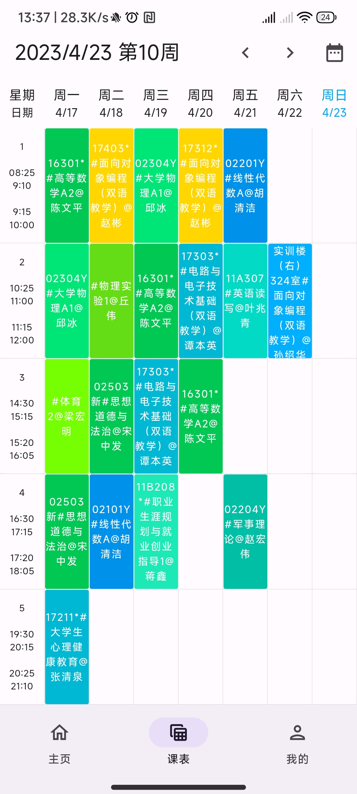
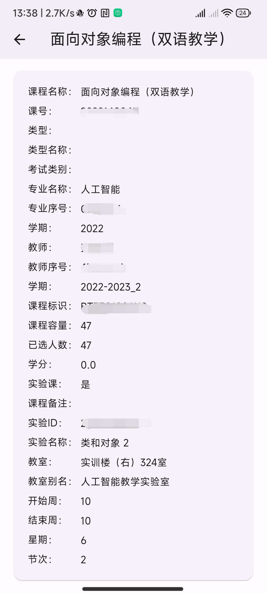

# GUETHUB 一个使用 Flutter 开发的全平台桂林电子科技大学 GUET 课程表，此项目正在开发中...
**此项目使用 Dart 和 Rust 语言开发**

用户协议：[user_agreement.md](user_agreement.md)
隐私政策：[privacy_policy.md](privacy_policy.md)

## 目前支持本科生教务系统（包含专升本）使用，未支持研究生教务系统
支持 Android IOS 未上架，Windows Linux MacOS 可以使用，但未做发布

下载地址 [https://www.guethub.net](https://www.guethub.net)

## **下面是一些已实现的功能的截图**

## 许可证：MPL2.0
Mozilla Public License Version 2.0
