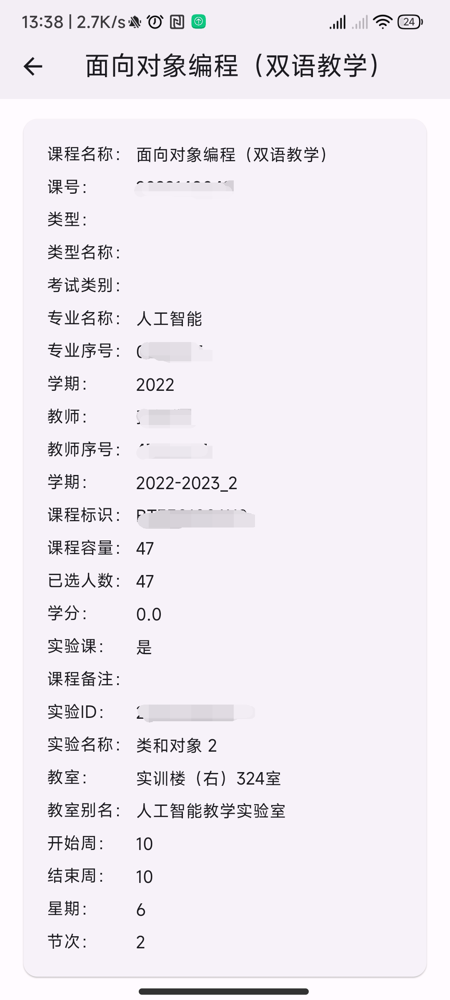
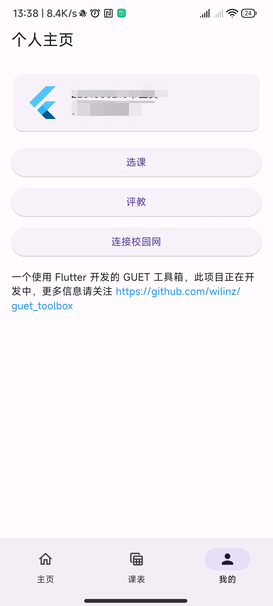
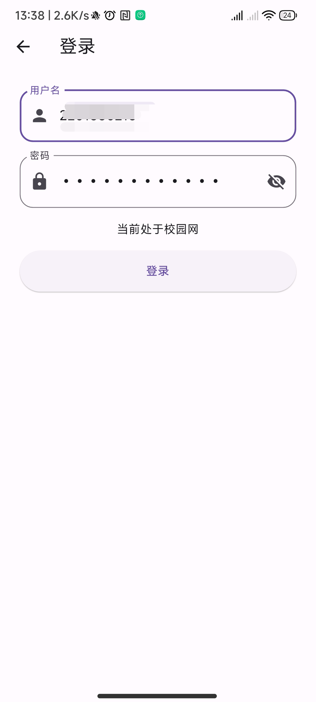
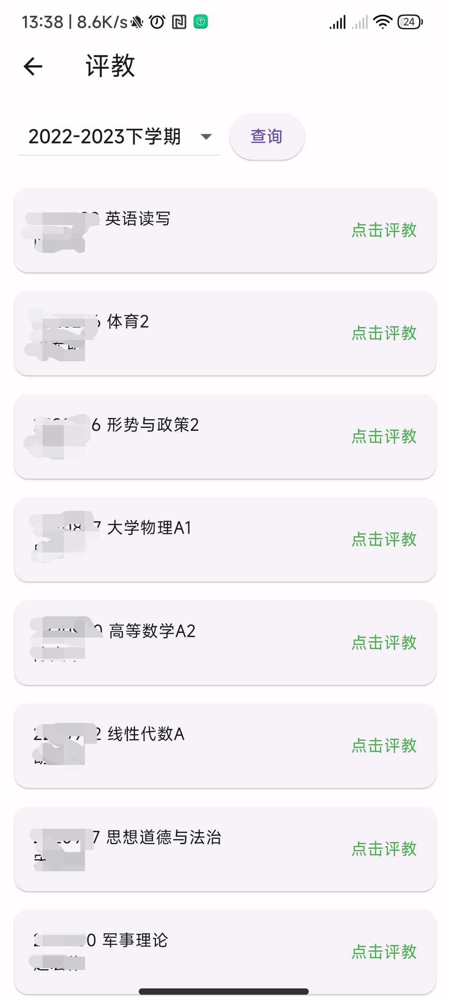
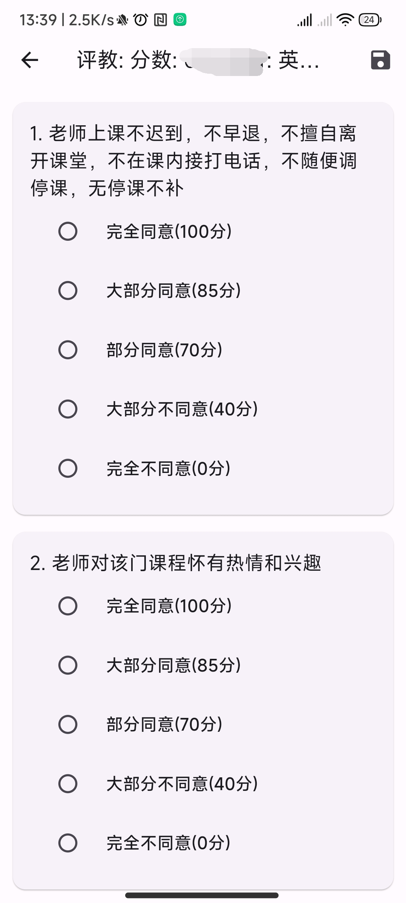
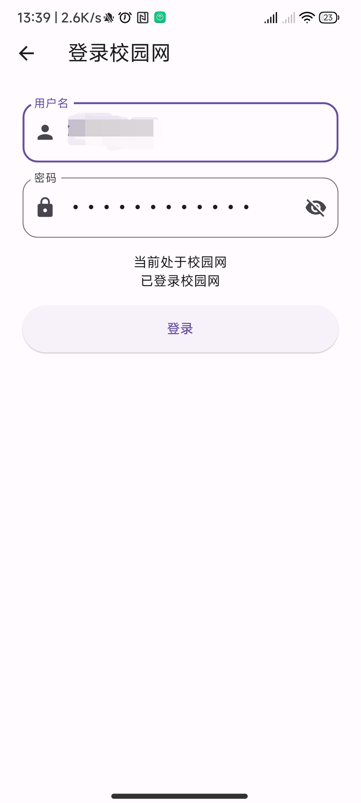

# Guet-Toolbox
一个使用 Flutter 开发的全平台 GUET 工具箱（教务系统客户端），此项目正在开发中...

## **下面是一些已实现的功能的截图**















Windows 安装 openssl，安装路径：C:\Program Files\OpenSSL-Win64
```powershell
Set-ExecutionPolicy Bypass -Scope Process -Force; [System.Net.ServicePointManager]::SecurityProtocol = [System.Net.ServicePointManager]::SecurityProtocol -bor 3072; iex ((New-Object System.Net.WebClient).DownloadString('https://community.chocolatey.org/install.ps1'))
choco install openssl
```
Linux 安装 openssl
```shell
apt install libssl-dev
```

Flutter 生成代码
```shell
flutter pub run build_runner build
```

Web运行在指定端口
```shell
flutter run -d chrome --web-port 8888  --web-hostname 0.0.0.0
```

Json to dart:
```shell
#会覆盖，修改原json名为"_"开头可忽略此文件，避免覆盖
flutter pub run json5_model --src=lib/data/json  --dist=lib/data/model
```

```shell
#windows sdk路径
"C:\Program Files (x86)\Windows Kits\10\bin\<version>\x64"
```

windows构建msix证书生成
```shell
#替换方括号中内容并去掉方括号
msixherocli.exe newcert --directory ./certs --name testname --password password --subject CN=testname --validUntil "2054/1/25 23:01:34"
```
windows构建msix
```shell
#release
flutter pub run msix:create
#debug
flutter pub run msix:create --debug
#创建自签名msix安装程序
flutter pub run msix:create -c ./certs/testname.pfx -p password
```
windows打包安装器
```shell
choco install innosetup
```

```shell
curl -o https://raw.githubusercontent.com/jrsoftware/issrc/main/Files/Languages/Unofficial/ChineseSimplified.isl
```

windows打包
```shell
iscc innosetup/setup.iss
```
签名apk
```shell
apksigner  sign  --v4-signing-enabled false --ks xxx.jks  --ks-key-alias alias  --out app-arm64-v8a-release-signed.apk app-arm64-v8a-release.apk
```
```shell
for file in ./*.apk; do
      filename="${file##*/}"
      echo "Signing ${filename}"
      apksigner sign --v4-signing-enabled false --ks xxx.jks  --ks-pass env:ANDROID_KS_PASS --ks-key-alias alias  --out ${file} ${file}
    done
```
brew
```shell
/bin/bash -c "$(curl -fsSL https://raw.githubusercontent.com/Homebrew/install/master/install.sh)"
```

## 许可证：MPL2.0
基于 Mozilla Public License Version 2.0 并附加以下条款：

* **非商业性使用** — 不得将此项目及其衍生的项目的源代码和二进制产品用于任何商业和盈利用途